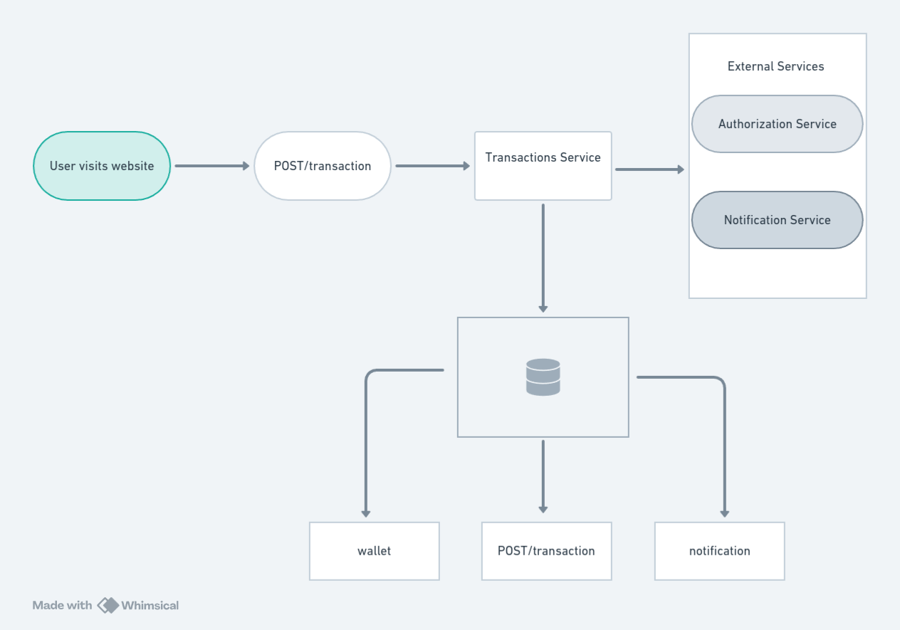
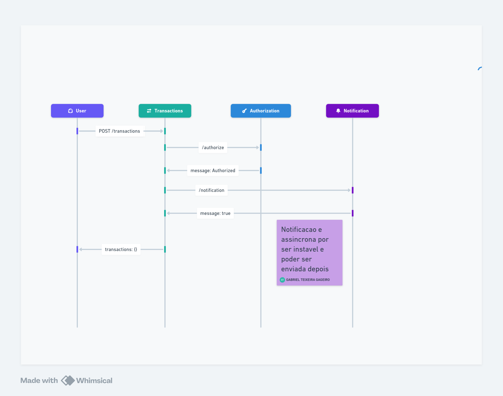

# picpay-simplificado-desafio

[Desafio realizado](https://github.com/PicPay/picpay-desafio-backend?tab=readme-ov-file)

# Tecnologias
___

- Spring
- Docker-compose
- SQLite
- Kafka

# Arquitetura

---

---

# API

---

- 

- 
